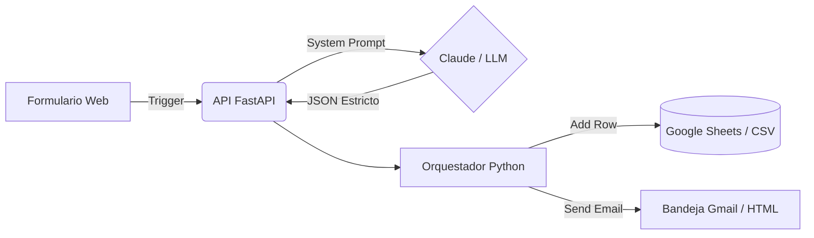

# PROYECTO FINAL
Introducción a la Inteligencia Artificial - Redacción
**Mini SaaS de optimización de CV asistido por Inteligencia Artificial**

---

## 1. Documentación Breve

### 1.1 Problema Elegido
Gran parte de las personas que buscan empleo —especialmente quienes están en sus primeras búsquedas laborales o cambian de rubro— redactan sus CV de forma genérica y descriptiva en lugar de estar orientados a resultados. Esto genera dos problemas:
* Los sistemas ATS (Applicant Tracking Systems) descartan currículums que no contienen palabras clave.
* Los reclutadores tardan menos de 10 segundos en el primer filtro visual, y un CV sin logros cuantificados pierde esa oportunidad.

### 1.2 Descripción de la Solución
Construir un mini SaaS que reciba el texto de un CV, lo evalúe y devuelva:
* Un resumen profesional reescrito.
* Cada experiencia laboral mejorada con verbos de acción y foco en logros.
* Un listado de palabras clave relevantes faltantes.
* Un puntaje estimado ATS (0–100) y recomendaciones accionables.

### 1.3 Herramientas Utilizadas
* **Python y FastAPI:** Para construir la API de backend que centraliza la lógica.
* **Claude (API de Anthropic):** LLM utilizado para la reescritura de contenido siguiendo instrucciones de formato estricto (JSON).
* **HTML/CSS/JS (Vanilla):** Interfaz de la demo funcional para ejecutar el proyecto en el navegador.
* **Google Forms, Make/Zapier, Sheets y Gmail (Simulados vía Script):** Para la automatización del proceso end-to-end.

### 1.4 Decisiones Tomadas
* Devolver JSON estructurado en lugar de texto libre para separar contenido de presentación.
* Implementar un enfoque de "nota de editor" (el modelo explica por qué cambió algo) para darle mayor transparencia al usuario.
* No persistir CVs completos por defecto para minimizar el manejo de datos sensibles.

---

## 2. Implementación del Proyecto Funcional (Flujo Completo)

El flujo se diseñó como un pipeline de 5 etapas, implementado y probado a través de dos scripts de Python (`cv_optimizer_api.py` y `automatizacion_flujo.py`).

1. **Ingreso (Trigger):** Simulación de webhook (Formulario).
2. **Procesamiento:** Validación y formateo del prompt.
3. **IA:** Llamada a la API de FastAPI que invoca al LLM.
4. **Registro:** Appendeo de metadatos en un archivo CSV.
5. **Salida:** Generación de un archivo HTML simulando el correo final.

---

## 3. Evidencia de Funcionamiento (Capturas del Demo)

### 3.1 Diagrama de Arquitectura


### 3.2 Captura de Ejecución (Logs del Backend)
```bash
$ python automatizacion_flujo.py
=== INICIANDO FLUJO ===
1. [Trigger] Nueva respuesta: Analista de Datos Jr.
2. [IA] ¡Respuesta recibida y parseada correctamente! (Puntaje ATS: 58)
3. [Registro] Fila agregada en registro_analisis_sheets.csv
4. [Entrega] Email generado exitosamente en email_enviado_gmail.html
=== COMPLETO ===
```

### 3.3 Captura de la Bandeja de Salida (Email Generado)
> 📧 **Asunto: ¡Tu CV ha sido optimizado con IA! 🚀**
> 
> 🟩 **Puntaje de Compatibilidad ATS:** 58/100
> **Palabras clave faltantes:** *Excel avanzado, Tablas dinámicas, SQL, Power BI*
> 
> 💼 **Mejoras en tus Experiencias:**
> ~~Antes: hacía tareas de oficina y archivo~~
> **Ahora: Gestionó la organización de información y brindó soporte clave a procesos contables, asegurando precisión de datos.**
> 🔴 *Nota del editor: Se cambió a verbos de acción y se resaltó la relación con el análisis de datos.*

---

## 4. Casos de Uso y Pruebas

Para validar el sistema, se definieron y probaron distintos casos de uso (Inputs) y sus respectivas validaciones (Outputs).

### Caso de Prueba 1: Perfil junior sin experiencia formal
* **Input utilizado (Puesto):** Analista de Datos Jr.
* **Input utilizado (CV):** "Estudiante avanzado. Experiencia como encargado de caja en supermercado y ayudante administrativo. Habilidades: Excel."
* **Output generado (Validado):** Puntaje bajo (42/100). Resumen reescrito enfocado en manejo de datos numéricos (caja, conciliaciones) como base transferible a análisis de datos. Sugirió sumar palabras clave como "SQL" o "Power BI".

### Caso de Prueba 2: Perfil con experiencia pero sin logros cuantificados
* **Input utilizado (Puesto):** Coordinador de Atención al Cliente
* **Input utilizado (CV):** "3 años en call center. Encargado de atender llamados y resolver reclamos."
* **Output generado (Validado):** Experiencia reescrita para sugerir placeholders: *"Gestionó un volumen de [X] llamados diarios..."*, incluyendo una nota del editor recordando al usuario reemplazar la "[X]" con sus datos reales.

### Caso de Prueba 3: Sin descripción del puesto
* **Input utilizado:** Se dejó el campo opcional "Descripción del puesto" completamente vacío.
* **Output generado (Validado):** El sistema infirió correctamente palabras clave estándar basándose únicamente en el "Puesto Objetivo", demostrando que el flujo no se rompe por falta de datos opcionales.

---

## 5. Reflexión Final

### 5.1 Qué funcionó bien
* **Contrato de Salida (JSON):** Forzar al modelo a devolver exclusivamente un objeto JSON estructurado simplificó muchísimo la integración entre el backend y la interfaz final, evitando tener que parsear texto libre impredecible.
* **Transparencia (Notas del editor):** El enfoque de "antes / después" con un comentario de la IA resultó más útil que entregar el CV reescrito de golpe, permitiendo al usuario decidir si está de acuerdo con el cambio.

### 5.2 Qué problemas surgieron
* **Alucinaciones / Embellecimiento:** En las primeras iteraciones del prompt, el modelo tendía a "inventar" cifras o logros para hacer que el CV se viera mejor, lo cual es riesgoso en un contexto laboral. Hubo que agregar reglas explícitas de "honestidad" en el System Prompt.
* **Formateo Rebelde:** A veces, a pesar de pedir exclusivamente JSON, el LLM agregaba bloques de Markdown (` ```json `) o saludos introductorios. Se resolvió creando rutinas de limpieza "defensivas" en el backend de Python antes del parseo.

### 5.3 Cómo se mejorarían los resultados
* **Verificación de Fact-Checking:** Se agregaría una etapa secundaria (un segundo llamado a la IA) que verifique estrictamente que la versión optimizada no contenga ningún sustantivo, empresa o fecha que no esté en el documento original.
* **Editor Interactivo:** En lugar de enviar un mail o mostrar texto estático, permitir que la UI web deje al usuario aceptar o rechazar las sugerencias individualmente y luego descargar un archivo `.docx` o `.pdf` formateado.
* **Puntaje ATS Real:** Integrar el sistema a una librería real de parsing de currículums (como las que usa la industria de RRHH) para que el puntaje no sea solo una estimación probabilística generada por el LLM.
